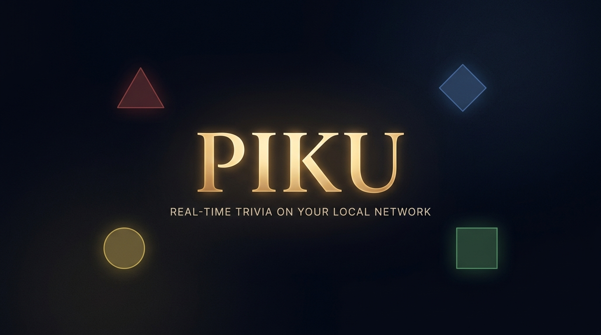

<p align="center">
  
</p>

<p align="center">
  
</p>

<h3 align="center">Piku</h3>
<p align="center">
  <b>ES:</b> Trivia en tiempo real por Wi-Fi. Sin registro, sin internet, sin base de datos.<br>
  <b>EN:</b> Real-time trivia over Wi-Fi. No signup, no internet, zero database.
</p>

<p align="center">
  <a href="#-quick-start">= 18"></a>
  
  
  
</p>

---

## ✨ What is it? / ¿Qué es?

**ES:** Piku es una plataforma de trivia en vivo ultra-rápida y ligera para redes locales. El anfitrión proyecta las preguntas en una pantalla grande y los jugadores responden desde sus celulares escaneando un QR. Todo ocurre 100% en tu red local. 

**EN:** Piku is an ultra-fast, lightweight live trivia platform for local networks. The host projects questions on a big screen, and players answer from their phones by scanning a QR code. Everything runs 100% locally.

## 🎯 How it works / Cómo funciona

1. **Host / Anfitrión:** Abre `http://localhost:3000` y crea una sala. / Opens `http://localhost:3000` and creates a room.
2. **Players / Jugadores:** Escanean el QR desde sus celulares. / Scan the QR code from their phones.
3. **Play / Jugar:** Las preguntas se proyectan → tocas las formas de color para responder. / Questions are projected → tap the colored shapes to answer.
4. **Win / Ganar:** Marcador en vivo y podio final con confetti. / Live leaderboard and final podium with confetti.

## ⚡ Quick Start / Inicio Rápido

```bash
git clone https://github.com/obeskay/piku.git
cd piku
npm install
npm start
```

**ES:** Abre `http://localhost:3000`. Para conectar celulares, escanea el QR.
**EN:** Open `http://localhost:3000`. To connect phones, just scan the QR code.

### Custom Port / Puerto personalizado

```bash
PORT=8080 npm start
```

## 🌐 i18n (Internationalization)

**ES:** Piku detecta tu idioma y ahora incluye un botón "🌐 EN/ES" directamente en la interfaz para cambiarlo en tiempo real.
**EN:** Piku auto-detects your language and now features a "🌐 EN/ES" toggle button directly in the UI for instant switching.

## 🛠️ Stack

| Layer | Tech / Tecnología |
|------|-----------|
| **Backend** | Node.js, Express, ws, qrcode |
| **Frontend** | HTML5, Vanilla CSS (OKLCH), ES6+ |
| **Audio** | Web Audio API (Zero external assets) |
| **Typography** | Instrument Serif + Outfit |
| **State** | In-memory + LocalStorage |

## 🤝 Contributing / Contribuir

1. Fork the repo / Haz un fork
2. `git checkout -b feature/amazing-feature`
3. `git commit -m "feat: add amazing feature"`
4. `git push origin feature/amazing-feature`
5. Open a Pull Request / Abre un PR

## 📄 License / Licencia

[MIT](LICENSE)
